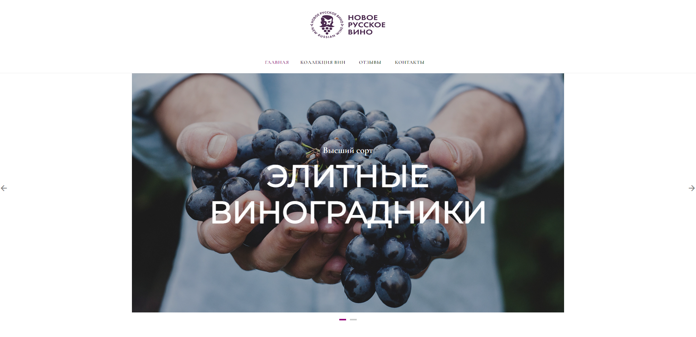

# Новое русское вино

---

Сайт магазина авторского вина "Новое русское вино".

## Установка зависимостей
Первым делом, скачайте код:
``` 
git clone https://github.com/pas-zhukov/wine.git
```
Для работы скрипта на вашем компьютере должен быть установлен интерпретатор [Python 3.9 или старше](https://www.python.org/downloads/), а также библиотеки, перечисленные в `reqirements.txt`.
Библиотеки можно установить при помощи **pip**:
```
pip install -r requirements.txt
```
Проверить, что всё получилось правильно, можно командой, которая отображает список установленных библиотек:
``` 
pip list
```

## Данные для работы сайта
Для корректной работы сайта необходимо подготовить данные о товарах в формате excel-таблицы следующего вида:

| Категория  |      Название       |      Сорт       | Цена |         Картинка         |        Акция         |
|:----------:|:-------------------:|:---------------:|:----:|:------------------------:|:--------------------:|
| Белые вина |     Белая леди      | Дамский пальчик | 399  |     belaya_ledi.png      | Выгодное предложение |
|  Напитки   | Коньяк классический |                 | 350  | konyak_klassicheskyi.png |                      |
| Белые вина |      Ркацители      |    Ркацители    | 499  |      rkaciteli.png       |                      |
- В колонке "Сорт" могут быть пропущены значения, тогда сорт винограда для конкретного товара указан на сайте не будет.
- К картинкам товаров с текстом в столбце "Акция" будет прикреплена специальная надпись "Выгодное предложение".
- Все прочие колонки для каждого товара обязательно должны быть заполнены. Картинки новых товаров необходимо помещать в папку `images`.

В качестве шаблона/примера в репозитории представлен файл `products.xlsx`, который также можно использовать для тестового запуска.

## Запуск


2. Запустите сайт командой в терминале:
```
python main.py
```
3. Перейдите на сайт по адресу [http://127.0.0.1:8000](http://127.0.0.1:8000).

Если всё было сделано верно, сайт откроется:




## Цели проекта

Код написан в учебных целях — это урок на курсе по Python и веб-разработке на сайте [Devman](https://dvmn.org).
